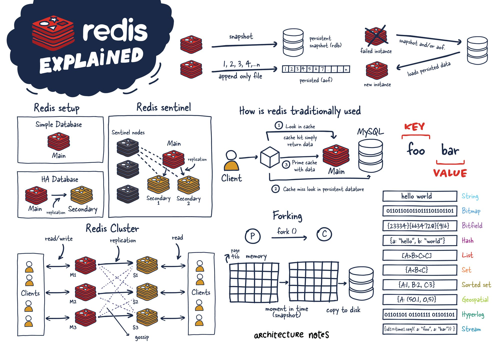
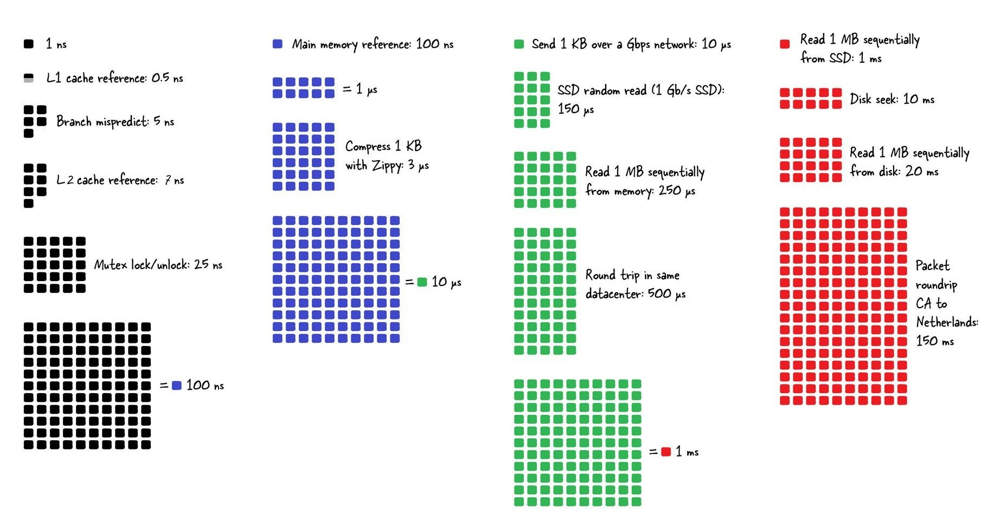

# Caching Learning Notes

<!--
https://diginomica.com/valkey-91-ships-hybrid-search-ai-maintainer-agents-engine
Valkey project maintainer Madelyn Olson on the 9.1 release including hybrid search, AI maintainer agents and a 10% memory reduction. Plus a candid read on durability, SSD tiering and where the project sits next to a re-energized Redis.
https://thenewstack.io/valkey-91-cuts-memory/
Valkey 9.1 launched this week at the Open Source Summit with 10% memory savings, database-level ACLs, CLUSTERSCAN, integrated vector search, and a GA Valkey Admin tool for cluster operators.

https://github.com/valkey-io/valkey/tree/unstable/src
https://valkey.io/topics/persistence/
https://valkey.io/topics/protocol/
https://valkey.io/commands/
https://valkey.io/topics/benchmark/
https://valkey.io/topics/lru-cache/

2025 - Demystifying Clustering in Valkey
https://docs.google.com/presentation/d/1-oY_Y_hKVFu5oLF6iT9t3TGvmNKMbkFX/edit?slide=id.g3588a3ccce8_2_253#slide=id.g3588a3ccce8_2_253
https://hasgeek.com/rootconf/2025/sub/demystifying-valkey-cluster-architecture-internals-WJYeTVakwJT3Kwm9iKMnqx

https://docs.digitalocean.com/products/databases/valkey/
https://docs.digitalocean.com/products/databases/valkey/how-to/choose-eviction-policies/
-->

## Valkey

[Top 8 Redis Use Cases](https://www.linkedin.com/posts/j-mahamed_redis-devops-systemdesign-share-7467146250451132417-bv6-/?utm_source=share&utm_medium=member_desktop&rcm=ACoAAAOxk18BcgN6WcUZfIqPuO1XxHylxwxaOJ4)

[Architecture Notes- Redis](https://architecturenotes.co/p/redis)

Architecture Notes- Redis Explained Infographic

[Redis Keys Explainer (Geeks for Geeks)](https://www.geeksforgeeks.org/system-design/a-complete-guide-to-redis-keys/#google_vignette)

[Memcached](https://memcached.org/): Compared to Redis, lacked data types, had limited eviction policy, multi-threaded, required setup in distributed cluster

Jeff Dean: Latency Numbers Every Programmer Should Know (graphic from GitHub user ayshen via [hellerbarde](https://gist.github.com/hellerbarde/2843375)); Info originally provided by [Peter Norvig](https://www.norvig.com/21-days.html#answers). 

## Redis Internals

<!--
11th
https://x.com/arpit_bhayani/status/2052951085573423214
12th
https://x.com/arpit_bhayani/status/2053314925087346970
18th
https://x.com/arpit_bhayani/status/2060923868886511846
26th
https://x.com/arpit_bhayani/status/2071073659343732932
-->

[Redis Internals- Build Redis from Scratch](https://www.youtube.com/playlist?list=PLsdq-3Z1EPT0eElcdOON9fdaeaQjlyXDt) by Arpit Bhayani

[Redis Internals- Reading Materials](https://docs.google.com/document/d/1lHKI6bia3ZEPoAKgXWIm_SKv_Sii1qtN3EYMEdxKpEQ/edit?tab=t.0)

[Redis Internals- PDFs](https://drive.google.com/drive/u/1/folders/1-a1xtA0e4J6Jkmiy68TGHtbyCbInZi64)

[DiceDB](https://dicedb.io/) [DiceDB GitHub](https://github.com/dicedb/dicedb)

[Why and How Is Single-Threaded Redis Fast and Can Handle Multiple Connections?](https://youtu.be/h30k7YixrMo?si=A6W1b8d0ydo0hcap)

Open-source, in-memory data structure store. Flexibility and simplicity. 

Uses
* Cache
* Database
* Message broker
* Streaming engine

Some [data types](https://valkey.io/topics/data-types/)
* hash
* list
* set
* sorted set
* bitmap
* hyperloglog
* geospatial indexes
* streams

Some data type use cases
* Realtime chat
* Message buffer
* Gaming leaderboards
* Auth session store
* Media streaming
* Realtime analytics

Every operation on Redis is atomic ("When command is executing, Redis does not context switch and start executing another command." You don't have to worry about concurrency. Regardless of how many TCP connections/clients.)
* putting a key
* adding to list
* set union | intersection (don't have to worry about another thread, parallel thing while doing union)
* incrementing the value (count++ is not thread-safe)

This is the beauty of redis.

In-memory- caching is the most common use of Redis. But...
* Redis provides configurable persistence.
* Can periodically dump data in memory to disk (if Redis process crashes, reboots, it doesn't start from scratch, can load last file dumped)
* Can provide partial persistence to write-ahead logging of all commands (every command logged in aof- append only file that can be used to reconstruct Redis or setup replication another Redis)
* Or no persistence at all (everything kept in memory, if crashes, ok losing all data)

Other key features
* Transactions
* Pub/Sub (Publisher/consumers listening to same Redis on topic, when publisher publishes, all consumers listening to topic receive message, push-based)
* TTL on keys (expiration, auto-delete; if no expiration, you will have memory-leaks)
* LRU eviction (will accept writes, will not crash, will auto-evict key)

Concurrent programming models (doing more than one thing at the same time)- single process

Multiple ways to achieve concurrency in single process mode
* 1st, most common approach: multi-threading

Multi-threading- every incoming request over network accepted by server and executed in separate thread
* Client connects to your database with command to execute, spin up new thread handling requests from client. Every new client has a new thread to handle everything. 
* request 1 -> increment k -> thread 1 / request 2 -> increment k -> thread 2

Multi-threading problem- how to ensure data correctness?
* Classic problem of concurrency: k=10, two threads executing k++ (k++ is not thread-safe), possible final values are 11 or 12 (unpredictable behavior)
* Way to solve: one thread acquires a lock while the other thread waits; first thread only releases when it's done and other thread takes over (always end up with 12) 
* Two threads is true concurrency

Ways to secure data correctness with pessimistic locking
* [Mutex](https://en.wikipedia.org/wiki/Lock_(computer_science))
* [Semaphore](https://en.wikipedia.org/wiki/Semaphore_(programming))

[Mutex versus Semaphore](https://www.geeksforgeeks.org/operating-systems/mutex-vs-semaphore/)

I/0 Multiplexing (apparent concurrency, not "true concurrency")
* How event loops are implemented
* [System calls](https://en.wikipedia.org/wiki/System_call) happen in background to do I/O operations (disk I/O, network I/O)
* [I/O system calls](https://www.geeksforgeeks.org/c/input-output-system-calls-c-create-open-close-read-write/) are blocking
* Two servers connected over TCP connection- read from socket- read() blocks until other person sends ("this is extremely painful"... you are just waiting)

Popularity of multi-threading
* This is why multi-threading is popular, to avoid being blocked
* While one thread is waiting, other thread is scheduled on CPU to execute
* This is slow. Blocked thread is ready to execute, but can't. 

I/O Multiplexing is a way of doing better. How multiplexing works: 
* Use I/O monitoring calls to monitor the sockets and fire "read" on the ones that have data
* We do not invoke read() unless we know we are being sent data

Any single-threaded db or process that claims to be supporting a large number of concurrent I/Os- this is execution behind the scenes

What this event loop looks like
* Single thread- not a separate thread or process (see diagram)
* Everything running in one thread only
* Accept many incoming TCP connections, read from a socket/execute incoming command, do again and again (system call tells you when there is data)
  
What Redis "beautifully" exploits:
* Network I/O is slow (waiting on commands, reading)
* In-memory ops is fast (operations are all in-memory, very fast; upon receiving commands, Redis can very quickly execute)

Redis design choice
* Single threaded (no need for mutex, semaphore, blocked threads/waiting)
* Doing I/O multiplexing (can handle multiple, even a large number, of TCP connections concurrently)

[Writing a Simple TCP Echo Server - Step 0 to Build Your Own Redis](https://youtu.be/zlxdX9f4l50?si=iDos7c6LSnlTQBHE) 

[Wire Protocols, Why Are They Needed, and Redis' Wire Protocol - RESP](https://youtu.be/PtJl3jtmqgE?si=tdF0Ypx-jCagasXg)

<!--
https://valkey.io/topics/protocol/
-->

"For a Redis Server to understand what a client wants, the client needs to follow a protocol": [Redis Serialization Protocol](https://redis.io/docs/latest/develop/reference/protocol-spec/)

RESP supports common datatypes ("Redis is an extremely simple database")
* int (:)
* string (+), bulk string ($)
* arrays (*)
* a way to convey errors (-)

Serializing an array of strings using RESP: PUT K V ["PUT", "K", "V"] 

RESP is a request-response protocol (client sends request in RESP, server sends response in RESP)

Datatype starts with special character and ends with \r\n (CLRF)

Examples:
* Simple string: +PONG\r\n\ (very efficient, very low memory overhead, requires n+3 bytes in response)
* Integer: :1729\r\n
* Bulk strings: $4\r\n\PONG\r\n\ (PONG is 4 bytes, binary safe, see explanation)
* Array (see explanation)
* Errors: -Key not found\r\n

Importance of bulk strings
* Simple strings are not binary safe (can contain any byte)
* Simple strings cannot contain \r\n (also a terminator)
* It knows exactly how many bytes to read. Can store and send any binary info. 
* Can be used to store any binary data (even a PNG image)

Some special strings
* Empty string: $0\r\n\r\n
* Null value: $-1\r\n (length -1 is special value indicating lack of data)

Arrays

["a", 200, "cat"] becomes:
*3\r\n (asterisk, number of elements, CLRF, RESP-enoded elements)
$1\r\na\r\n
:200\r\n
$3\r\ncat\r\n

Some special arrays
* Empty array: *0\r\n
* Null array: *-1\r\n (length -1 is special value indicating lack of data)
  
Note: can also have nested arrays

RESP highlights:
* Human readable
* Simple, fewer bugs
* Performant
* Uses prefixed lengths (from beginning, it knows exactly how many bytes to read, even for arrays, memory optimization)

Why not use JSON
* They are very "bulky"

[Implementing Redis' Wire Protocol - RESP](https://youtu.be/wnHZHGc8tW8?si=025wLUAUFmtE4B7q)

[Implementing Redis' PING Command](https://youtu.be/70UJ1QTQj5Y?si=foFDCG3F1he8pTkB)

[Event Loops Internals And How Redis Handles Multiple Connects on a Single Thread](https://youtu.be/U2IFZ_hw91o?si=VzZ55CHC4z1cf0hc)

Asynchronous networking supporting concurrent clients

Traditional way- each client -> it's own thread. Threads can be scheduled on multiple CPUs. Can run large number on concurrent clients, but needs to be made thread-safe. 

Answer is I/O Multiplexing or Asynchronous I/O- how every single event-loop you have heard of is implemented

Python Async I/O, JavaScript?, libevent, libuv

If language is "single-threaded" but event loop is separate thread, it is not single-threaded. If is separate thread, why can't schedule normal CPU instructions to it? event-loop is neither separate thread nor separate process. Thin layer that only supports I/O. 

Mupltiplex has to be provided by kernel system call interface to be notified. 

Depending on OS and flavor, 3 ways to implement: EPOLL (Linux), KQueue (Mac), IOCP (Windows). Code same, just system call and arguments change. 

Single thread supporting large number of concurrent clients

Focusing on EPOLL
* Can monitor many file descriptors for new I/O
* In Unix and most OS, everything is a file (socket, disk I/O, memory buffer, I/O devices- external devices, usb devices, etc), has file descriptor (32 bit integer value that uniquely identifies a file- disk or socket)
* Pass in all file descriptors you would want to monitor
* EPOLL tells you which one(s) ready for new I/O

How EPOLL works
* Client connects via a socket (network card- internet port, wifi card), this triggers interrupt
* Kernel stop doing everything else and reads from network card, data is now in the kernal buffer
* Normal user application code would not have access to this space
* 100s of processes are running in application space- node.js, python, browser, etc
* CPU has limited ports- at max four processes can move forward concurrently
* When your process is schedule on the CPU to execute, data will be copied from kernel space to user space, that is how your socket you are managing in code gets the data
* Before the copy step happens there will be time when the kernel knows it has the data for the process and can tell EPOLL
* Kernel buffer has access to both kernel space and user space
* This is how I/O happens, and it is the heart of EPOLL

Core idea: 
* EPOLL checks if I/O is ready
* If yes, do I/O; if not, continue

When client connecting to server, get socket file, register file descriptor with EPOLL. EPOLL will monitor every client connection along with the main server socket. 

EPOLL syscalls:
* epoll_create1- create new epoller
* epoll_wait- waits for updates on registered file descriptors (blocking call, moves forward only when file descriptor(s) are ready for I/O)
* epoll_ctl- register/deregister file descriptor

Ready means data has been sent (until that time, socket is blocked, because client has yet to send data)

Read, write, receive are blocking system calls. Without EPOLL, you couldn't move forward. 

<!--
https://man7.org/linux/man-pages/man2/syscalls.2.html

https://man7.org/linux/man-pages/man7/epoll.7.html
https://en.wikipedia.org/wiki/Kqueue
https://developer.apple.com/library/archive/documentation/System/Conceptual/ManPages_iPhoneOS/man2/kqueue.2.html
https://en.wikipedia.org/wiki/Input/output_completion_port
https://learn.microsoft.com/en-us/windows/win32/fileio/i-o-completion-ports
https://docs.python.org/3/library/asyncio.html
https://github.com/libevent/libevent
https://github.com/libuv/libuv
-->

[Implementing Event Loops](https://youtu.be/SMmLVHgE4pM?si=zBAklRoupJpBKkLA)

[Implementing GET, SET, and TTL Commands in Redis](https://youtu.be/1rnEpo56LFk?si=mQ_wlfl0z_aDEMam)

<!--
https://valkey.io/commands/getset/
https://valkey.io/commands/ttl/
-->

[Implementing DEL, EXPIRE, and Cleanup in Redis](https://youtu.be/yGdk0hmvkgo?si=yDESzMspeziXVFht)

<!--
https://valkey.io/commands/del/
https://valkey.io/commands/expire/
-->

[Key Eviction Strategies in Redis and Implementing Simple First Eviction](https://youtu.be/EkaTFT9ox-I?si=a_JL5bK2PUm4d-Tf)

<!--
https://valkey.io/topics/lru-cache/
https://redis.io/docs/latest/develop/reference/eviction/
https://docs.digitalocean.com/products/databases/valkey/how-to/choose-eviction-policies/
-->

Keys Eviction

Redis is RAM-bound. We cannot have unbounded storage. To accomodate newer data, we need to evict older data. 

When reach limit and RAM is full, if insert large number of keys, and not enough RAM to allocate, process would crash. Out-of-memory error. 1 GB limit and exhuasted. 

How Redis evicts?
maxmemory configuration that limits the max amount of data it can hold. When it reaches, it evicts old data. 

Some common strategies
* noeviction- new values aren't saved when memory limit is reached
* allkeys-lru- removes least recently used keys (recommended in Digital Ocean Valkey docs)
* allkeys-lfu- removes least frequently used keys
* volatile-lru- removes LRU keys with EXPIRE set
* volatile-lfu- removes LFU keys with EXPIRE set
* allkeys-random- picks some keys at random and evicts them (uniform access across keys)
* volatile-random- picks some keys with EXPIRE set at random to evict (uniform access across keys)
* volatile-ttl- picks key with shortest TTL and evicts it

Use lfu when keys that are used often need to be kept in memory. 

Approximated LRU (Redis 3.0)

Redis LRU is approximated, not an exact algorithm. Satisficing, very memory-efficient. 

Core idea: take "n" samples of "k" keys, evict LRU

Exact LRU requires extra memory. Which key accessed when? Imagine a DLL (double linked list), additional memory overhead of maintaining pointers is overkill. 

Redis uses that memory for data instead of pointers. 

New LFU Mode (Redis 4.0)

Storing a huge integer value is costly. An integer for every key (0-1 million). Requires 4 bytes across all keys. Every time we get or update, it does frequency++

Approximately instead

Morris Counter- does not use regular integer and frequency++, it is space-efficient counting

You can store 1 million value in 2 or 3 bytes. 

frequency is not ever-increasing. Decay over time reduces value. 
* Saturate counter at 1 million requests
* Decay the value every 1 minute
* You can configure this in redis.conf file

Even if dip in key access, it should not be evicted? Comparison to stock market. 

<!--
How probabilitistic data structures are build
See research paper
https://arxiv.org/abs/2010.02116
https://arpitbhayani.me/blogs/morris-counter
-->

[Implementing Command Pipelining](https://youtu.be/2q7RuEb9z-M?si=SYLiGS1yRsKAfXX5)

[Implementing AOF Persistence](https://youtu.be/5SnkVoatBpA?si=iisw--vzrqNDbCrO)

Redis has period persistence. Data in-memory can be optionally flushed to disk. 

Persistent formats
* RDB (Valkey Database)
* AOF (append-only file)

<!--
https://valkey.io/topics/persistence/
-->

[Object, Encodings, and Implementing INCR](https://youtu.be/Dl9h6sQAFfk?si=VAM1SrLDVxqAin64)

[Implementing INFO and allkeys-random Eviction](https://youtu.be/jmN3VRsUmRs?si=OhqFJnW29r0OH4w-)

[The Approximated LRU Algorithm](https://youtu.be/0kOCyjFKKL4?si=cszXqNpgAbnJI3xl)

[Implementing the Approximated LRU Algorithm](https://youtu.be/FvGGkzcKKFA?si=shVnUABoIb8DBT8t)

[How Redis Caps Its Memory Usage](https://youtu.be/xNfoeZuK3Mc?si=RrX-BRTiPInpC2bR)

[How and Why Redis Overrides Malloc](https://youtu.be/RCNMYljRmY4?si=YY0Upev-gHoCIO5n)

[How Databases Implement Graceful Shutdown using Signal Handling](https://youtu.be/l-Bf0Ssf2GE?si=_KpjU00cF9Y08lmv)

[How Redis Implements Transactions and How We Implement It](https://youtu.be/USZAZeuP8Iw?si=pQLyHpfgDoPXoXfN)

[How Redis Internally Implements Memory Efficient Lists - Ziplist and Quicklist](https://youtu.be/2EknAibFgu8?si=k7Prr7yNQnI-sNZZ)

[How Redis Internally Implements Memory Efficient Sets - Intset](https://youtu.be/OPxs_D47yCI?si=_DgoXNLlcr__adpv)

[How Redis powers Geospatial Queries using GeoHash Algorithm](https://youtu.be/rAi1h7dltCk?si=G_-qvMMA6pZJBYWt)

[How Redis Implements Strings](https://youtu.be/Bx7ykrizjCY?si=3FIDoGSgp0g8fND8)

[Hyperloglog and Cardinality Estimation](https://youtu.be/tOsb-tFoPCg?si=SEoCmh6_IDLN8OMN)

[How Redis implements LFU using Morris Counter](https://youtu.be/q6Q2ou0hCws?si=5JbOd_3UziJnbZk9)
